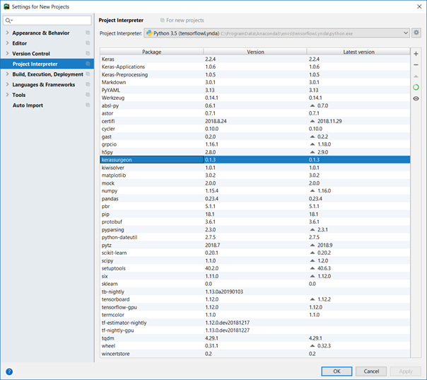

# cnn-planesnet

This project is about compressed CNNs for airplane classification in satellite images using average-percentage-of-zeros-based <b>parameter pruning</b> and INT8 weight <b>quantization</b>. It also evaluates the impact of epochs and the batch size on the accuracy for good baseline parameters and experiments with modified CNN architectures. 

## Project overview

The measurements in the respective folders contain the measurement data, graphs and model files.

### Main program:
* `main`: Splits the dataset, trains the model and compresses it with pruning and quantization.
* `parameters`: The parameters contained in this file are read by both `main.py` and the batch execution files. They contain settings for epochs, batch size, pruning and quantization, e.g., the minimum / maximum / current / increment value.

### Batch execution:
* `batch_execute`: Allows to vary the epochs and batch size both on their own and one after another. You need to <b>set the `mode`</b> in the source code manually.
* `batch_quantization`: Varies epochs and batch sizes while batch quantizing models found in a specified directory. 

### CNN architecture: 
* `cnn_definitions`: Defines the [baseline CNN](https://www.kaggle.com/amro91/planes-classification-with-cnn) for the experiment (`cnn1`). Variations of `cnn1` can be performed in 6 lines in `cnn2`. My attempt to create my own CNN from the scratch is contained in `cnn3`. 
  * `givenCNN`: Contains the results for varying the <b>batch size</b> and the number of <b>epochs</b> for `cnn1`.
  * `modifiedCNN`: This folder captures what happens when you uncomment certain lines of 1-6 of `cnn2`, giving an insight on how the results change depending on the layers included.
  * `ownCNN`: Measurements for my own CNN (`cnn3`). These are probably not relevant because I have stopped varying my CNN when I noticed that changing an already working CNN is much less effort, but yields better results.

### CNN compression:
* `cnn_utils`: Contains the implementation of pruning and quantization. The two folders in the `quantize` method <b>need to be adjusted</b>.
  * `pruning`: folder with pruning results
  * `quantization`: folder with quantization results 

## Sample commands

Download the [planesnet.json dataset](https://www.kaggle.com/rhammell/planesnet/data), rename it to `planesnet.json` and place it in the project's root directory. This might require creating a Kaggle account.

Please refer to the following picture as to which packages should be installed.

For the quantization to work, you need to have `tf_nightly` installed. `tensorflow-gpu` is also needed, including the appropriate cuDNN and Cuda drivers (for NVIDIA GPUs).

Now you can run the Python files `main.py`, `batch_execute.py` and `batch_quantization.py`. There are no parameters, since the files access and adjust `parameters.json` to get the configuration.